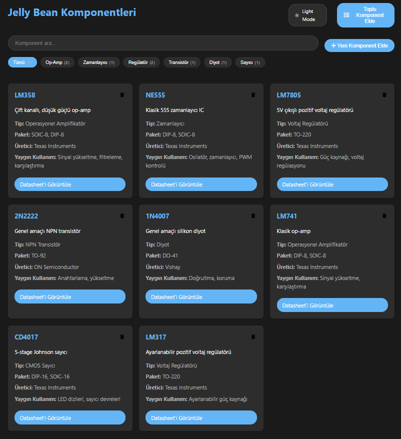
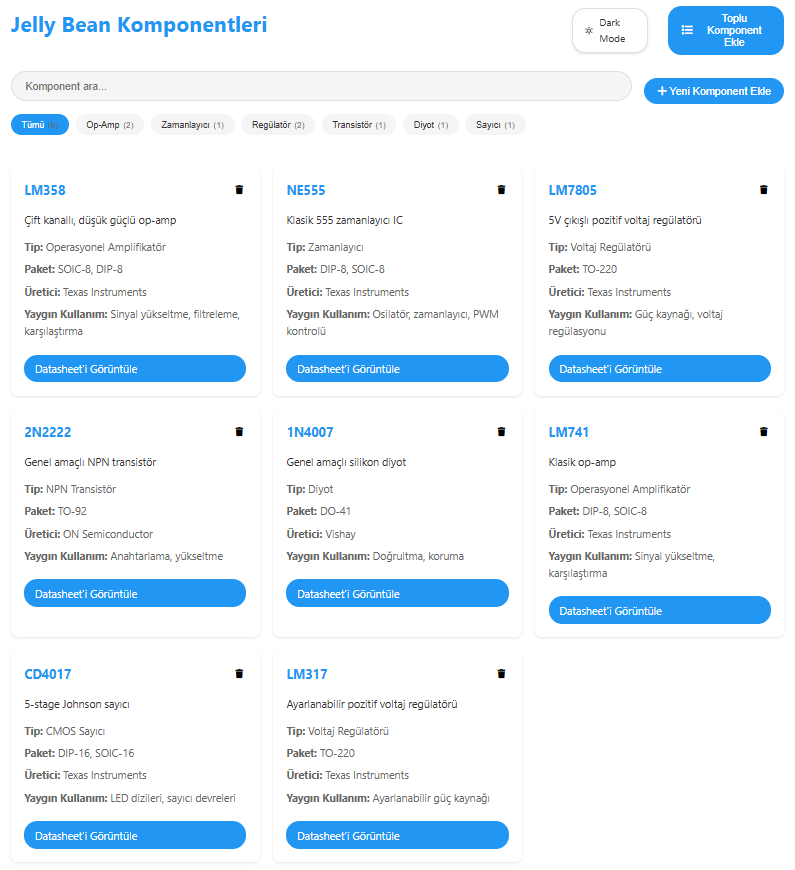

# Jelly Bean Components

A simple, interactive web application for browsing and managing common electronic components such as op-amps, timers, regulators, transistors, and diodes.

🔗 **Live Demo:** [https://oknkcr.github.io/ComponentSearch/](https://oknkcr.github.io/ComponentSearch/)



---

## 🚀 Features

- 🌗 Light/Dark mode toggle
- 🔍 Real-time component search
- 🏷️ Category filtering (Op-Amp, Timer, Regulator, etc.)
- 📄 View component datasheets
- ➕ Add new components individually or in bulk
- 🗑️ Remove components easily

---

## 🛠️ Built With

- **HTML** – Page structure
- **CSS** – Styling, responsive layout, theming
- **JavaScript** – Interactivity and logic (search, filters, dynamic UI)

---

## 📂 Project Structure

```
ComponentSearch/
├── index.html
├── style.css
├── script.js
├── assets/
│   └── screenshot.png (UI preview image)
```

---

## 🧪 How to Use Locally

1. Clone the repository:

```bash
git clone https://github.com/oknkcr/ComponentSearch.git
cd ComponentSearch
```

2. Open `index.html` in your browser.

No server or build tools are required.

---

## 🌍 Language

The app interface is currently in **Turkish**. Multilingual support may be added in future updates.

---

## 📃 License

This project is licensed under the [MIT License](LICENSE).

---

## 🙋‍♂️ Author

Developed by [@oknkcr](https://github.com/oknkcr)  
Feel free to contribute or open issues!

---

## 💡 Screenshot


